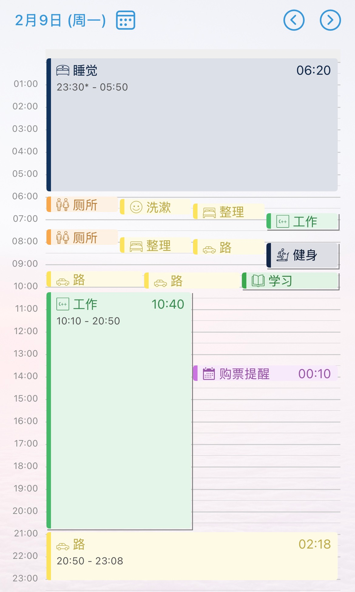

# 2026-02-09

> 让我们在人生的更高处相见吧

## 计划

### 🎯 今日最重要的3件事

> 每天最好是只完成同一主线的任务，比如同一个研究。然后今天只完成写作或者只完成工程。
>
> 交付产出一定是别人可以阅读可以复用的资产

| 任务                                               | 最低产出                                       |
| -------------------------------------------------- | ---------------------------------------------- |
| EvolveLRM-ARR论文、工程、实验 （详见日志.md） | ‼️ 工程完成初步框架，目前第6️⃣天了，好慢啊 |
| LogicEvolve优化                                    |                                                |
| LogicSurvey                                        |                                                |

### 📋 任务清单

> 交付产出一定是别人可以阅读可以复用的资产

| 任务                        | 预期交付产出           |
| --------------------------- | ---------------------- |
| EvolveLRM-工程              | ⌛️ 代码新增LOG      |
| EvolveLRM-实验              | 实验结果与可复现性报告 |
| EvolveLRM-ARR论文           | 论文第二稿             |
| LogicEvolve to do list 推进 | 改论文/工程/实验       |
| 📅 专利                     | 专利书                 |
| 📅 开题准备                | 选题报告+PPT           |

### ⏰ 重要时间节点

| 事项 | 截止时间                                                                                                                                                                                                                                                                                                                                                     |
| ---- | ------------------------------------------------------------------------------------------------------------------------------------------------------------------------------------------------------------------------------------------------------------------------------------------------------------------------------------------------------------ |
| 会议 | -[ICML](https://icml.cc/Conferences/2026) [OpenReview](https://openreview.net/group?id=ICML.cc/2026/Conference)，讨论3月下旬    - [ARR](https://aclrollingreview.org/dates) 全文3月16日，通知4月15日  - [NeurIPS](https://neurips.cc/Conferences/2025)、SIGMOD 4月份开放提交 - [AAAI](https://aaai.org/conference/aaai/aaai-26/) 7月份 - ICLR 9月份 |
| 开题 | 3月12日前自查开题条件，准备开题报告 4月3日前准备开题PPT   4月中旬开题答辩                                                                                                                                                                                                                                                                        |

### 📥 快速记录想法

> 参考GTD方法：随时记录，稍后整理

| 想法/任务                                                                                                                                                                              |
| -------------------------------------------------------------------------------------------------------------------------------------------------------------------------------------- |
| 工程：运行过程中需要记录时间和cost，这是对比人工成本的必要操作                                                                                                                         |
| 工程：检索可使用FAISS                                                                                                                                                                  |
| 相关工作：自动化训练的大厂产品有很多，但都只做到了自动化；和我的研究相比。。。                                                                                                         |
| 工程：OpenCompass是一个Python包，支持评估和基准测试所需的各种大型语言模型与数据集。                                                                                                    |
| 相关工作：流体智力（Fluid Intelligence），意思就是指不依赖于已有的知识，在全新情境下进行逻辑推理、识别模式和解决问题的能力。（[出处](https://mp.weixin.qq.com/s/TUPekE8KbnefLdPfBtstlA)） |
| 相关工作：clawbot和我的工作很像，比如都使用了adapter模式等                                                                                                                             |

## ⚠️ 关键注意点

1. 如果实在想玩耍，设置一个5分钟沉浸式：5分钟内完成一个最小化的任务，屏蔽一切干扰，5分钟后我有权选择停止
2. 按小时设置目标，并按小时进行目标检查——防止精力分散
3. 时刻记录——防止注意力不集中
4. 输入一定同时输出——避免无效输入
5. 注意休息——番茄工作法：20-20-15分钟/小时，前两个20分钟后休息20秒，最后15分钟后休息5分钟。
6. 动力来源：比自己优秀的博主那么多，随便找1个都是鸡血满满

## 💼 主要

> 🪥 内务

550-起床～～想哭突然

> 6-8 ｜🎯 计划

开发

> 8-9｜🏋️健身与自媒体

健身房：有氧椭圆机45分钟｜[赛博练胸day155 - 痞咖Pika | 小红书](https://www.xiaohongshu.com/discovery/item/6989355f000000001a02152e?source=webshare&xhsshare=pc_web&xsec_token=ABtkD1QnXk1NBxYiHAfT-0Aar9KpIl2Andpj96pk-Shck=&xsec_source=pc_share)

> 8-9｜📰 新闻与外文

学习：[今日日报](https://h5.lingowhale.com/s/I597Sgh)，单词33

> 10-｜目标：工程，完成evaluator改造（考虑logicevolve还未发布，所以需要可开源部分改造复用，而不是提及）

当前集中注意：

| 路径                                                                                     | 说明                 | 更新频率 |
| ---------------------------------------------------------------------------------------- | -------------------- | -------- |
| Drafts/EvolveLRM/日志.md Drafts/LogicEvolve/日志.md                                 | 详细更新日志与子任务 | ⚠️     |
| Drafts/EvolveLRM/工程/集群部署情况.md Drafts/LogicEvolve/工程/公司集群上副本情况.md | 记录部署情况         | 🍃       |

1604-6小时-还是没改完，东西太多

✅ 2.D-测试模拟监控过程:

- 1606-2-测试失败
- 1615-9-开始定位问题,问题是detect_empty_data中的路径错误
- 1629-14-解决问题

✅ 3-测试可视化：

- 开始测试
- 1646-开始修正
- 1655-9-解决问题

✅ 4-网站更新

- 504-开始检查
- 506-2-结束检查

外部评测支持

- 506-开始检查
- 523-17-部分修正
- 进行测试：test2629，543-20-失败
- 进行测试：test26，553-10-失败
- 进行测试：test27，失败
- 进行测试：test28，失败
- 进行测试：test29，612-
- 进行测试：test32
  - 第一步成功
  - 元数据保存位置出错，修正中
    - 元数据修正中(我觉得非常**desperate**)
    - 元数据部分修改完成，1939
  - 测试元数据保存继续
  - 测试成功，1947-8
  - 测试评测脚本生成
  - 基本测试成功

* ⌛️ 测试当前版本的auto evaluator
  * ✅ 改评测指南
  * 测试bbh，可以只使用单任务进行测试或者2任务，不要开太多

## ⌚️ 时间流

## 📊 每日回顾

### ✅ 今日完成情况

* 完成的主要任务：
  * EvolveLRM：
    * 测试模拟监控、可视化、网站更新、外部评测
    * 修正元数据agent
    * 改评测指南
