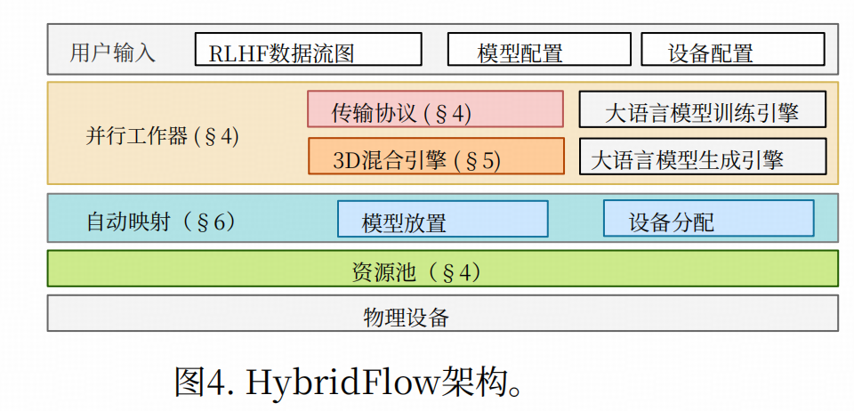

# VeRL

https://github.com/volcengine/verl

## 文档

1. Verl使用教程 https://zhuanlan.zhihu.com/p/1908296595872674564
2. 参考手册：https://verl.readthedocs.io/en/latest/start/install.html

## 框架 HybridFlow

A Flexible and Efficient RLHF Framework

1. https://arxiv.org/abs/2409.19256
2. https://github.com/volcengine/verl fork了一个私有仓库
3. https://github.com/eric-haibin-lin/verl-community

HybridFlow中的关键信息

1. 我们提出混合流 （HybridFlow），它以混合方式结合单控制器和多控制器范式，实现RLHF数据流的灵活表示和高效执行

   1. 我们的核心洞察是：在节点间层面采用单控制器范式能灵活表达各类数据依赖关系，并以最小开销协调节点间数据重分片；同时在节点内计算中集成多控制器范式可大幅提升计算效率。

## 算法 DAPO

An open-source llm reinforcement learning system at scale. *[arXiv preprint arXiv:2503.14476, 2025.](https://arxiv.org/abs/2503.14476)*

1. Project Page: https://dapo-sia.github.io/
2. https://github.com/volcengine/verl

## 复现

* [VeRL复现](https://zhipu-ai.feishu.cn/docx/TZ9Udb9UKoP9Fix3Fmpc0bFDn6h?from=from_copylink)
  * 基本环境安装
  * 数据准备与预处理
  * PPO训练
  * 合并模型
  * 模型加载：sglang

### 训练指标说明

> [VeRL] logger指标解释 https://zhuanlan.zhihu.com/p/1920830068344751263
>
> 和VeRL提供的标准日志样例进行比较 https://verl.readthedocs.io/en/latest/algo/baseline.html#algorithm-baselines

* actor: 记录Actor模型训练相关的指标，包括策略损失、KL散度、梯度范数等，用于监控策略网络的训练状态和收敛情况。
  * actor/entropy_loss: actor 策略分布的熵，衡量了策略的随机性或探索程度。
  * actor/pg_loss: Policy Gradient Loss，actor的核心损失函数。
  * actor/ppo_kl: 新旧策略之间的KL散度
  * actor/kl_loss: KL散度惩罚项的损失值, 通常等于 kl_coef * ppo_kl。
  * actor/kl_coef: KL惩罚项的系数  可以是固定的，也可以是自适应调整的。自适应 kl_coef 会根据 ppo_kl 的大小动态调整，以使其保持在目标范围内。
  * actor/pg_clipfrac: 在一个训练批次中，有多少比例的样本的概率比率超出了裁剪范围而被裁剪。
  * actor/pg_clipfrac_lower: 是pg_clipfrac的一个细分，表示有多少比例的样本是因为概率比率小于  而被裁剪。
  * actor/grad_norm: actor模型在反向传播后计算出的梯度的L2范数
  * actor/lr: actor的学习率
* critic: 记录Critic模型相关的指标，包括优势函数、回报值、奖励信号等，用于监控价值网络的训练效果和奖励计算。
  * critic/score/* (Scores): 从奖励函数或奖励模型（Reward Model）中获得的原始、未经修改的奖励分数,是计算最终 rewards 的基础。
  * critic/rewards/* (Rewards): 最终用于计算优势函数（advantage）的奖励信号。它由奖励模型打出的原始分数（score）经过可选的 KL 惩罚项调整后得到。公式可以理解为：rewards = scores - β * kl_divergence。
  * critic/advantages/* (Advantages): 优势函数 A(s, a) = Q(s, a) - V(s)，在 PPO 中通常使用广义优势估计（[GAE](https://zhida.zhihu.com/search?content_id=259483758&content_type=Article&match_order=1&q=GAE&zhida_source=entity)）计算得出。它衡量了在状态 s 下采取动作 a 相对于平均水平（由 Critic 的价值函数 V(s) 评估）有多好。
  * critic/returns/ (Returns): 对未来奖励的折扣累加和，即 G_t = r_t + γr_{t+1} + ...。它是 Critic 模型（价值网络）要拟合的目标。
* global_seqlen: 监控数据并行训练中的负载均衡情况，确保不同GPU/Worker之间的计算负载分布均匀。
  * balance batch的核心目的是解决在数据并行（[Data Parallelism](https://zhida.zhihu.com/search?content_id=259483758&content_type=Article&match_order=1&q=Data+Parallelism&zhida_source=entity)）训练中，不同 GPU/Worker 之间负载不均的问题。由于处理长序列比短序列需要更多的计算资源，如果一个批次的数据被随机分配，可能会导致某些 GPU 分到很多长序列，而另一些 GPU 分到很多短序列，前者就会成为训练瓶颈。因此，代码中实现了一个均衡策略，在将数据分发给各个 worker 之前，先对批次内的数据进行重排，以确保每个 worker 分到的总 token 数量（即序列长度之和）大致相等。这组指标就是用来衡量这个均衡策略的效果的。
  * global_seqlen/(max/min/mean): 均衡前整个训练批次（batch）中原始序列长度的分布情况。
  * global_seqlen/(balanced_max/balanced_min): 均衡后分配给每个 worker 的负载情况，“负载”指的是每个 worker 所分到的所有序列的长度之和。（即，balanced_max表示在所有 worker 中，单个 worker 负载的最大值。）
  * global_seqlen/minmax_diff: balanced_max - balanced_min。越小说明不同 worker 之间的负载差距越小，训练效率也就越高。
* perf: 记录训练性能和资源利用率指标，包括吞吐量、内存使用、时间消耗等，用于评估训练效率和资源使用情况。
  * perf/time_per_step: 完成一个完整训练步骤（step）所花费的总时间，单位为秒。这个时间覆盖了从数据生成（rollout）、奖励计算、优势估计到 actor 和 critic 模型更新的全过程。
  * perf/total_num_tokens: 在当前训练步骤中处理的 token 总数。这包括了批次中所有样本的 prompt 和 response 的有效 token 数量。(在 `compute_throughout_metrics`中，通过加总 `batch.batch["attention_mask"]` 张量中的所有元素得到)
  * perf/throughput: 训练的吞吐量，以“每秒处理的 token 数”（tokens/sec）为单位，是衡量训练效率的关键指标。
  * perf/mfu/actor: Model FLOPs Utilization 模型浮点运算利用率, 标衡量了GPU的实际计算效率。
  * perf/cpu_memory_used_gb: driver进程所使用的 CPU 内存量
  * perf/max_memory_allocated_gb, perf/max_memory_reserved_gb: GPU 显存使用情况
* prompt_length & response_length: 监控输入提示和生成回复的长度分布，包括长度统计和截断比例。
  * prompt_length/(max/min/mean): 在batch中，prompt的长度分布情况
  * prompt_length/clip_ratio: 在当前批次中，有多少比例的 prompt 因为长度超过了预设的最大长度而被截断
* timing_per_token_ms: 提供训练各阶段每token处理时间的精细化度量，用于性能分析和瓶颈识别。
  * timing_per_token_ms/gen: 在 rollout 阶段，生成一个 token 平均需要花费的毫秒数，是衡量推理性能的核心指标。
  * timing_per_token_ms/ref: 计算reference policy的对数概率时，处理一个 token 平均需要花费的毫秒数。
  * timing_per_token_ms/update_actor: 更新 Actor 模型 时，处理一个 token 平均需要花费的毫秒数。
  * timing_per_token_ms/adv: 在控制器（driver）进程上计算优势函数（advantage） 时，处理一个 token 平均需要花费的毫秒数。
* timing_s: 记录训练各阶段的总耗时，用于整体时间分析和优化。
