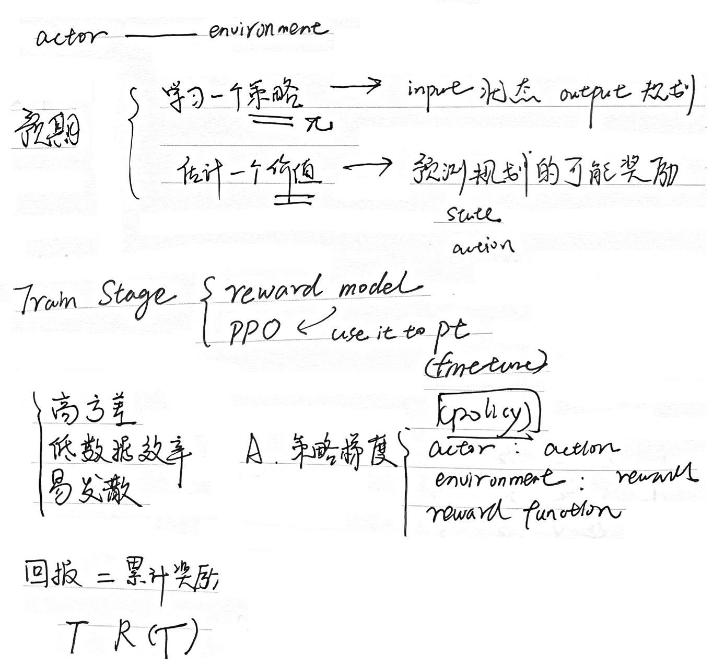
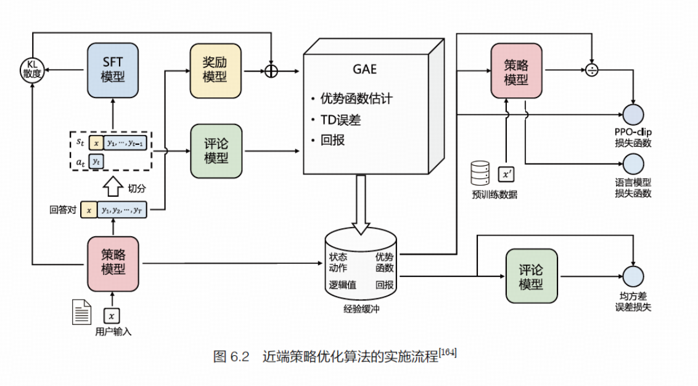
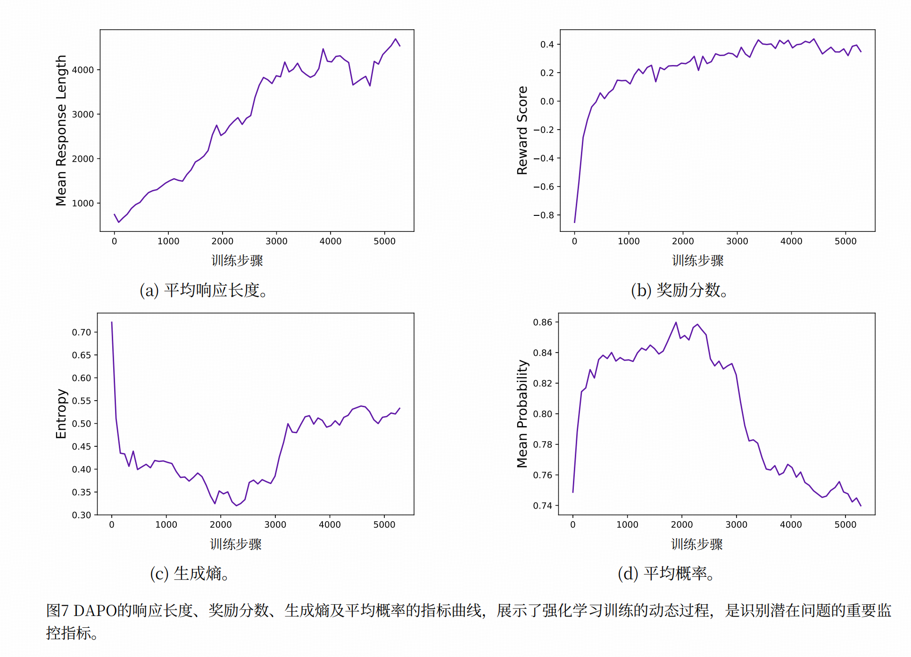

# RLHF

## 基本构成

## 常用算法

### PPO

算法解读：[模型|PPO Training 训练RLHF模型](https://zhipu-ai.feishu.cn/docx/PdvtdtaJconj6jxEdPUcwOxOnGg?from=from_copylink)

* [人人都能看懂的PPO原理与源码解读](https://zhipu-ai.feishu.cn/docx/YOsIdFP9voRsn7xzoxqcZBXgnDg?from=from_copylink)（[原始文件](https://www.cnblogs.com/zhangxianrong/p/18277086)）

近端策略优化涉及以下四个模型：

（1）策略模型（Policy Model），生成模型回复。

（2）奖励模型（Reward Model），输出奖励分数来评估回复质量的好坏。

（3）评论模型（Critic Model），预测回复的好坏，可以在训练过程中实时调整模型，选择对未来累积收益最大的行为。

（4）参考模型（Reference Model），提供了一个SFT 模型的备份，使模型不会出现过于极端的变化。

### GRPO

### DAPO

算法 Dapo: An open-source llm reinforcement learning system at scale. *[arXiv preprint arXiv:2503.14476, 2025.](https://arxiv.org/abs/2503.14476)*

Project Page: https://dapo-sia.github.io/

#### 关键信息

1. 提出解耦剪辑与动态采样策略优化（DAPO）算法，并完全开源了一个基于Qwen2.5‑32B基础模型、在AIME 2024上达到50分的最先进大规模强化学习系统
2. 背景

   1. 我们以Qwen2.5‑32B [12] 作为强化学习的预训练模型进行实验。在初始的朴素GRPO运行时，我们仅获得AIME 30分——这一性能显著低于深度求索的强化学习结果（47分）。深入分析表明，朴素GRPO基线存在若干关键问题，如熵崩溃、奖励噪声和训练不稳定性。
      1. 熵崩溃现象：随着训练的进行，策略的熵迅速下降
      2. 
   2. 我们开源了一个针对大规模LLM强化学习的最先进系统，该系统基于Qwen2.5‑32B模型 在AIME 2024上取得50分成绩，超越了此前由DeepSeek‑R1‑Zero‑Qwen‑32B [deepseek-r1中提到] （47分）使用50%训练步骤实现的最佳结果（图1）。
   3. 核心创新
      1. 剪辑更高（Clip‑Higher），提升系统多样性并避免熵崩溃；
      2. 动态采样（Dynamic Sampling），提高训练效率与稳定性；
      3. 令牌级策略梯度损失（Token‑Level Policy Gradient Loss），对长链推理强化学习场景至关重要；
      4. 过长奖励塑形（OverlongReward Shaping），降低奖励噪声并稳定训练过程。
3. 结果

   1. 生成响应长度是与训练稳定性和性能密切相关的指标，如图7a所示。长度的增加为模型提供了更大的探索空间，使得更复杂的推理行为能够被采样并通过训练逐步强化。但需注意，长度在训练过程中并非始终保持连续上升趋势，在某些较长时间段内可能呈现停滞甚至下降趋势。我们通常将长度与验证准确率结合使用，作为评估实验是否恶化的指标。
   2. 训练过程中的奖励动态始终是强化学习中的关键监测指标之一，如图7b所示。在我们的大多数实验中，奖励增长趋势相对稳定，不会因实验设置的调整而大幅波动或下降。这表明在可靠的奖励信号下，语言模型能够稳健地拟合训练集分布。然而我们发现，训练集上的最终奖励往往与验证集准确率关联性很低，这说明存在对训练集的过拟合现象。
   3. 行动者模型熵与生成概率与模型的探索能力相关，是我们在实验中密切监测的关键指标。直观而言，模型的熵需要维持在适当范围内。熵值过低表明概率分布过于尖锐，会导致探索能力丧失。反之，过高的熵值常与过度探索问题相关，例如无意义内容和重复生成。而生成概率的情况则完全相反。通过应用Clip‑Higher策略，我们有效解决了熵崩溃问题。在后续实验中，我们发现保持熵值缓慢上升的趋势有助于提升模型性能，如图7c和图7d所示。
