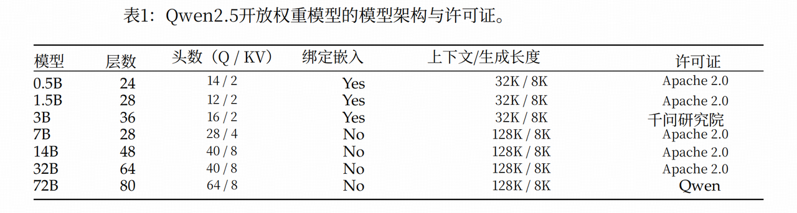

# Qwen

## 核心版本

### 2.5

1. 资源

   1. [https://huggingface.co/Qwen](https://huggingface.co/Qwen)
   2. https://modelscope.cn/organization/qwen
   3. https://github.com/QwenLM/Qwen2.5
2. 开源权重：开源权重版本包含0.5B、1.5B、3B、7B、140亿、320亿和720亿参数规模的基础模型和指令调优模型，同时提供指令调优模型的量化版本。
3. 逻辑推理：为增强模型的逻辑推理能力，我们引入了涵盖多个领域的70.000条多样化新查询。

   1. 这些查询包含选择题、判断题和开放式问题。
   2. 模型被训练以系统化方式处理问题，运用多种推理方法如演绎推理、归纳概括、类比推理、因果推理和统计推理。
   3. 通过迭代优化，我们系统地筛选出包含错误答案或缺陷推理过程的数据。这一过程逐步强化了模型进行逻辑准确推理的能力，确保在不同类型推理任务中表现稳健。
4. 奖励：

   1. 由于缺乏针对奖励模型的评估方法，当前奖励模型通常使用奖励基准进行评估。然而，我们从多个RM基准测试中的评估结果表明，过度优化特定基准测试可能触发Goodhart’s law (Hoskin, 1996)，导致在其他基准测试上的性能下降，并可能影响下游对齐性能。这突显了对奖励模型进行全面评估的必要性,应涵盖多样化的基准测试，而非仅依赖单一基准。
      1. Keith Hoskin. The “awful idea of accountability”: Inscribing people into the measurement of objects. Accountability: Power, ethos and the technologies of managing, 1996
      2. 英国经济学家查尔斯・古德哈特（Charles Goodhart）在 1975 年提出的
      3. 核心观点是 “当一个指标成为政策目标时，它就不再是一个好的指标”
   2. 更重要的是，通过迭代实验，我们还认识到一个关键局限:
      1. 当前的奖励模型评估基准测试无法准确预测在其指导下训练的强化学习模型的性能。
      2. 换言之，RM基准测试上的更高分数并不必然意味着由此产生的强化学习模型具备更优性能。
      3. 这一见解强调了需要进一步研究更具预测性的奖励模型评估方法。
