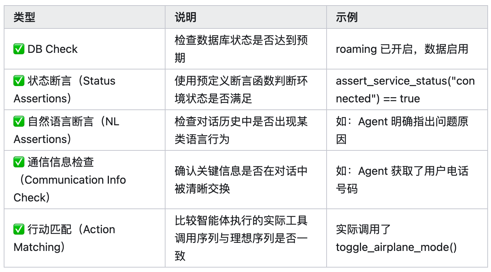

# T^2-Bench:在双控制环境中评估对话式智能体

> r^2-Bench: Evaluating ConversationalAgents in a Dual-Control Environment

现有针对对话式AI系统的基准测试方案模拟的是单控制环境，在这种环境中只有AI代理能够使用工具与外界进行交互，而用户则始终处于被动提供信息的角色。这与技术支持等现实场景存在差异，在这些场景中用户需要积极参与，以改变(共享)世界的状态。为了填补这一空白，我们引入了T^2-bench，它具备四项关键贡献:
1)一种新颖的电信双控制领域，建模为Dec-POMDP，其中代理和用户都利用工具在共享的动态环境中行动，测试代理协调与通信能力。
2)一种组合式任务生成器，可从原子组件编程创建多样且可验证的任务，确保领域覆盖和可控复杂度。
3)一个与环境紧密耦合的可靠用户模拟器，其行为受工具和可观测状态约束，从而提高仿真保真度。
4)通过多种消融实验(包括分离推理与沟通/协调产生的错误)对代理性能进行细粒度分析。
具体而言，我们的实验表明，当代理从无用户模式切换到双控制模式时，性能会出现显著下降，这突显了引导用户所面临的挑战。总体而言，T^2-bench为那些既需有效推理又需指导用户行动的代理提供了一个可控的测试平台。

# 原始信息来源

1. 不同Agent实现方式的效果：

   1. Function Calling（函数调用）：表现最好，主流模型如 GPT-4o 都支持

      1. [大模型 Function Calling 详解：核心原理、与 Tools 对比及企业级应用指南](https://blog.csdn.net/qq_46094651/article/details/150425991)1. Function Calling是对话式大模型中一种让模型能根据对话上下文，自动或半自动生成函数调用意图，并将调用结果融入后续对话的机制，形成可控的闭环。
      2. Tools/Plugins机制概述

         1. Tools/Plugins：多依赖“自然语言提示”或“命令式指令”让模型访问外部资源，结果返回后可能还需模型自行理解转换，参数传递较模糊。
         2. Function Calling：更强调结构化参数传递，让模型能精准输出调用意图和参数，而非模糊的插件请求，更适合需定制函数或严谨参数的场景（如财务计算、CRM数据编辑等）。
      3. Function Calling 的核心三步：定义工具、注册工具 和 使用工具。
   2. ReAct：迭代输出思考过程和JSON格式的action(类似工具调用)，性能中等

      1. [ReAct论文解读：LLM ReAct范式，在大语言模型中结合推理和动作](https://zhuanlan.zhihu.com/p/624003116)
         1. 让LLM把内心独白说出来，然后再根据独白做相应的动作，来提高LLM答案的准确性。——模型思考一步，然后采取行动一步，再思考一步，再行动，而不是隐式思考+最终行动
   3. Act-only：只输出 JSON 格式的action，不推理，效果最差
2. [τ-Bench 数据集解读：Agent如何“靠谱”地帮你订机票和退商品？](https://zhuanlan.zhihu.com/p/1906451624068617331)

   1. ICLR 2025 接收的一篇论文 **《τ-Bench: A Benchmark for Tool-Agent-User Interaction in Real-World Domains》** 就是试图来解答上面的问题。该论文提出了一个数据集 **τ-Bench** ，用于评估Agent在真实场景中完成订机票或者退换货的能力。
   2. τ-Bench 简单的说是**多轮对话+工具使用+规则遵守**的结合
   3. **一致性差是最大问题** ：GPT-4o 虽然单次成功率在 retail 可达 61%，但连续 8 次全成功的概率只有 25% 左右。
   4. 数据集构建方式

      1. 阶段 I：手动设计数据库 + API + 规则
      2. 阶段 II：用 GPT-4 自动生成结构化数据
      3. 阶段 III：任务构造与注释（人工 + 模型协作）
         1. **设计自然语言任务指令** ：由人工创建，要求具体、真实、无歧义。例如：“我想退掉这件衣服，然后顺便把椅子换成小号的，顺便告诉我一共能退多少钱。”
         2. **使用 GPT-4 function-calling 执行任务** ：生成代理可能的行为轨迹（多轮交互 + API 调用 + 回复）
         3. **轨迹验证与人工干预** ：
            1. 检查结果是否**违反规则**或**有多种合法操作方式**
            2. 若存在多解或不合理路径，修改用户输入或环境状态直到只剩 **一个合理的目标状态**
         4. **反向标注标准答案** ：
            1. 将最终数据库状态记录下来，作为 `r_action` 比对用
            2. 将正确回复（如退款金额、确认信息）写入 `r_output` 作为参考答案
         5. 最终，每个任务都拥有：
            1. 一个用户指令
            2. 一个**唯一正确**的数据库终态
            3. 可用于自动化评分的标准参考输出
   5. 未来工作

      1. 用户模拟器还能更聪明：现在的“用户”是 GPT 模拟的，未来可以让它更真实，更像真实的人类。
      2. 评估方式可以更细粒度：现在只看“数据库改得对不对、回复里有没有关键内容”，之后可以：
         1. 判断有没有违反更细节的规则(比如行李超重这种目前是靠模型自觉的)。
         2. 记录整个操作过程，分析中间过程有没有瞎操作。
      3. 构建任务可以更自动化：目前很多任务还是靠人工设计，比较耗时。后面可以用更强的模型来帮忙写用户需求、设计规则，甚至自动生成标准答案。
      4. 任务领域可以更复杂：现在只有电商和航班，之后还可以加上医疗、法律、税务这些更“烧脑”的场景，让模型真正学会在复杂环境下做正确的事。
3. [τ²-Bench最新论文解读](https://zhuanlan.zhihu.com/p/49404759454)

   1. τ-Bench存在的问题：
      1. 用户只能提供信息，无法改变环境状态，这个不符合现实场景。真实场景下，我们在做很多任务时，是和模型协作完成的，即模型做两步，我们做两步，逐步完成某项任务。
      2. 用户模拟时存在一些错误。τ-Bench为了做到自动化评测，会用大模型模拟用户和Agent进行交互，单纯使用自然语言描述用户的基本信息来控制用户行为，可能会在模拟过程中出现错误。
      3. 评估粒度较粗。主要是通过最终的数据库状态和最终回复内容中的关键词匹配的形式来评估，没有一些中间过程的评估。
   2. 核心贡献1：Dec-POMDP
      1. 为了解决前两个问题，即“用户只能提供信息，无法改变环境状态”和“用户模拟时存在错误”。τ²-Bench 使用了一个双控制环境，并形式化建模为一个 Decentralized Partially Observable Markov Decision Process（Dec-POMDP）。该建模允许两个智能体（Agent 与 User）同时进行通信、工具调用以及环境观测，很适合需要协同合作的问题。
      2. 形式化的好处
         1. 更真实的用户模拟：通过定义工具和观察机制，能高保真地模拟用户行为，而不是依赖模糊的自然语言。（解决τ-Bench存在的第二个问题）
         2. 协调和通信挑战：Agent 需要与一个有行动能力的 User 合作，这远比单向控制更贴近现实，也更具挑战。（解决τ-Bench存在的第一个问题）
         3. 更强的可控性：每个元素（如动作、奖励、观察）都是结构化的，便于调试和扩展。
      3. 完整的 Dec-POMDP 轨迹：状态变化、观测更新、信息传递、工具调用、目标达成。
   3. 核心贡献2：新领域telecom的任务构建流程
      1. 流程
         1. 阶段 1：创建Agent的数据库与工具——使用 LLM生成 PRD（产品需求文档），描述该领域的业务逻辑（如电信 CRM 系统）。然后由 LLM 自动生成：工具函数实现、模拟数据库（mock DB）、单元测试。最后，人工审查和完善代码直到所有测试通过，确保工具可用性和正确性。
         2. 阶段 2：创建User的数据库与工具
         3. 阶段 3：程序化任务生成器。采用组合式（compositional）方法从基本问题自动生成大量任务。
            1. 多个原子任务可以组合形成一个 复合任务
            2. 自动验证任务正确性
         4. 阶段 4：创建 Agent 的领域策略——根据生成的任务及其解决方案，用 LLM 自动生成领域策略文档（domain policy）。
         5. 阶段 5：人工审查与细化
      2. 特点
         1. 高自动化：大部分组件由 LLM 自动生成，包括数据库、工具、任务、策略。
         2. 可验证性强：所有任务都通过函数断言机制来验证结果正确性。
         3. 支持多样性与复杂性：从不同原子子任务组合生成成千上万个任务，并控制任务难度。
   4. 核心贡献3：细粒度的任务评估机制
      1. 多种不同的评估方式可用于进行更精细化分析与错误归因
      2. 状态断言评估机制（telecom专用）：任务的最终状态将通过一个或多个 断言函数（assertion functions） 来验证任务是否成功解决：
         1. 每个任务在定义时就设定了解决目标。
         2. 一旦对话结束（或 Agent 发出停止指令），系统自动执行这些断言函数。
         3. 所有断言通过 → 任务成功。

# 论文有关信息

1. 论文地址：[https://arxiv.org/abs/2506.07982](https://arxiv.org/abs/2506.07982)
