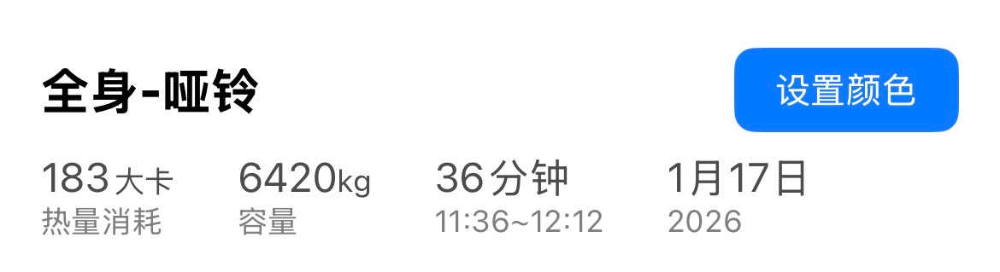
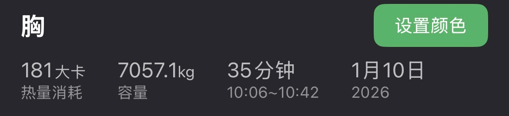
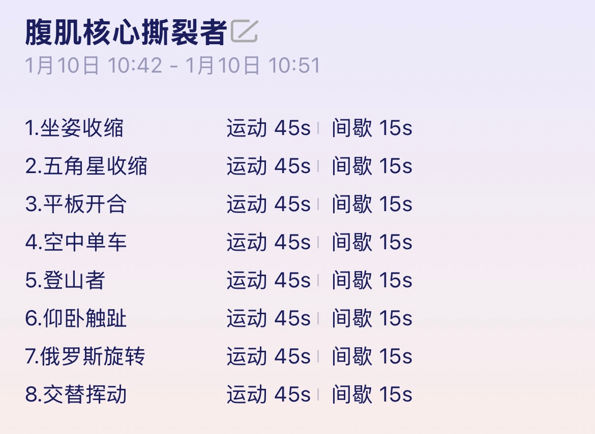
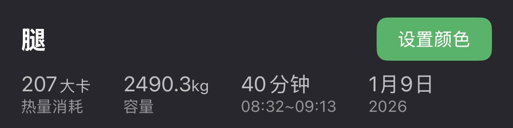

# Sports LOG

## 获奖

清华大学2025年健美比赛：健体A组(165-170cm)-第五名

## LOG

20260117

* 健身房
  * 有氧30分钟：椭圆机
  * 
  * [赛博练胸day138 - 痞咖Pika | 小红书 - 你的生活兴趣社区](https://www.xiaohongshu.com/discovery/item/696b117e000000001a01f35d?source=webshare&xhsshare=pc_web&xsec_token=ABEqO1ILvfTxxI_PfFJboatIhqLEOE9hmMgXscuZh2hbA=&xsec_source=pc_share)

20260112：差旅，无

20260111

* 健身房
  * 
  * [赛博练胸day137 - 痞咖Pika | 小红书 - 你的生活兴趣社区](https://www.xiaohongshu.com/discovery/item/69630c3c000000000e00c138?source=webshare&xhsshare=pc_web&xsec_token=ABG0_WlYjdEyo3CV0GKlyJbb7DyF5bo12WJ2WJOvVpMp4=&xsec_source=pc_share)
* 羽毛球
  * 羽毛球：2小时，胜利3局，败2局

20260110

* 健身房
  * 
  * 
  * [赛博练胸day136 - 痞咖Pika | 小红书](https://www.xiaohongshu.com/discovery/item/6961c1b2000000001a02ca72?source=webshare&xhsshare=pc_web&xsec_token=ABsTEB4z5sTpr_jCPZhKy8W_yMeYSshI6CQOmH-10vKgk=&xsec_source=pc_share)

20260109

* 健身房
  * 
  * [赛博练胸day135 - 痞咖Pika | 小红书 - 你的生活兴趣社区](https://www.xiaohongshu.com/discovery/item/69605df8000000001a01e3d2?source=webshare&xhsshare=pc_web&xsec_token=ABlxOB3W532USY7Wq0UTxIzjKDGUpqyx4G0AyodvnsVoY=&xsec_source=pc_share)
* 游泳馆
  * 游泳：40min（2130-2210）

20260108

* 健身房
  * 背：训记，1h10min，热量消耗739大卡，容量5681.6kg
  * 记录：[赛博练胸day134 - 痞咖Pika | 小红书](https://www.xiaohongshu.com/discovery/item/695f0d6c000000000e03dd71?source=webshare&xhsshare=pc_web&xsec_token=AB5kgtGsdwYuacxYbQqdiz7FMwjpTTQxEiLpbhy5k9qL0=&xsec_source=pc_share)

20260107

* 健身房
  * 胸：训记，18min
  * 记录：[赛博练胸day133 - 痞咖Pika | 小红书 - 你的生活兴趣社区](https://www.xiaohongshu.com/discovery/item/695db0ae000000001a0225f6?source=webshare&xhsshare=pc_web&xsec_token=ABvreL10Qfy1hls3F8_Jh364YGAMMtYxnrZBIlJLyWwiU=&xsec_source=pc_share)
* 游泳馆
  * 游泳：50min（2130-2220）

20260106

* 健身房
  * 有氧-椭圆机《[超燃运动会-5分钟踏行竞速赛](https://h5.merach.com/course-detail?sign=0b4bd9097a790fffa9631022953505ae3c940e37df36f1d86489e145faa24fae)》M5级别，21min
  * 常规：俯卧撑10*5，仰卧起坐50+50，10min
  * 记录：[赛博练胸day132 - 痞咖Pika | 小红书 - 你的生活兴趣社区](https://www.xiaohongshu.com/discovery/item/695c57ad000000001a033930?source=webshare&xhsshare=pc_web&xsec_token=ABo3sBjdoUhNqps4U8voCYcB_SE-65jFylJKjJjIdb-ro=&xsec_source=pc_share)

20251228

* 羽毛球

20251227

* 游泳、羽毛球相关技术学习
* 游泳
