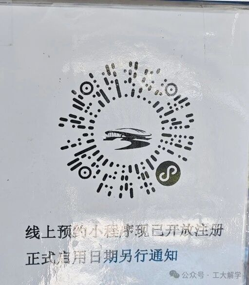

## 游泳

## 自由泳学习

### 学习路径

1. 腿：
   1. 腿型：双腿自然挺直，不僵硬、不锁死，保持微微放松的伸直状态。
   2. 发力：以大腿带动小腿发力，脚踝放松，小腿和脚顺势上下鞭打，允许自然轻微弯曲。
   3. 打水位置：打水动作要贴近水面、打出水面，让身体充分漂浮起来，不要只在水下乱踢。
2. 手：
   1. 一手扶浮板前端，身体保持水平俯卧打腿，身体尽量拉长、贴近水面。
   2. 另一个手画一个圆垂直于水面
      1. 前半程手掌划水从胸前到腿前，打腿，鼻子呼气水下
      2. 前半程（水下划水）手掌对水，从胸前附近向后划至大腿旁；持续打腿；鼻在水下缓慢呼气
      3. 后半程（出水 + 空中移臂）划水到大腿旁后顺势提肘出水手臂放松，从侧面切水前移，像用小臂 “切开水面，嘴全程吸气，转头换气： **向侧后方转头** ，不要抬头，只让嘴露出水面即可
3. 注意事项
   1. 两腿不要夹紧
   2. 整个过程不要用力，越放松越走水
   3. 抬头换气，不是挺身换气
   4. 吸气吐气不需要打满，自己节奏来，如果进水在嘴直接吐就好
   5. 横着拿板，头低到水里
   6. 打水在水上
   7. 最开始先随便动腿飘起来，再打腿
   8. 换气的时候也要一直打腿
   9. 单独练练抬头换气很有效
   10. 腿上下幅度越小越快越走水

### 网课

1. [24个课时最全游泳教学蛙泳自由泳](https://www.bilibili.com/video/BV1RP4y1z75q/?share_source=copy_web&vd_source=81659ded2cef583e77a037be7a04a472)

## 预约

### 清华大学陈明游泳馆

游泳馆自2026年1月10日起闭馆，具体开馆时间另行通知，往年预计是2月第一周周末。

预约：[链接](https://www.sports.tsinghua.edu.cn/venue/#/reserveList?uuid=f6bbfe4c96a84d519ab4495723914119)

时间段与人数：（建议每天晚上22:30后进行统计）

| 时间段      | 周一 | 周二 | 周三 | 周四 | 周五 | 周六 | 周日 |
| ----------- | ---- | ---- | ---- | ---- | ---- | ---- | ---- |
| 12:00-13:00 | -    | -    | -    | -    | >34  |      |      |
| 17:15-18:30 | -    | >39  | -    | >13  | >79  |      |      |
| 20:00-21:00 | -    | >13  | >131 | -    | >28  |      |      |
| 21:30-22:30 | -    | >5   | >28  | >102 | >11  |      |      |

最后场次建议游到22:10即上岸（40分钟），目前尝试22:20容易错过后续地铁。

交通：

* 注意由于最后吹头发可能排队，所以需要预留最后10分钟洗澡+5分钟穿衣服+5分钟吹头=20分钟时间
* 骑行：公司-游泳馆-2.1公里，12分钟
* 骑行：游泳馆-五道口地铁站-2.1公里，12分钟
* 地铁：13号线 首05:21 末23:37，10号线内环 首04:45 末23:03，最晚应该22点50抵达五道口

携带：泳裤、泳镜、泳帽、洗发水、沐浴露、毛巾、拖鞋、（吹风机）、（浮板）

### 中国地质大学（北京）游泳馆

中国地质大学体育馆-[公众号](https://mp.weixin.qq.com/s/nTphFEH4LeHSh9PkNnpEFw)

预约：[北地体育馆服务号](https://tyg.cugb.edu.cn/fwzd/yyzn/)

注意：提前1小时预约，刷身份证入校

收费：校外人员50元

营业时间：

* 周一、周一、周五 12:00-13:15、14:00-15:30、16:00-17:30、18:00-19:30、20:00-21:00
* 周三 12:00-13:15、16:00-17:30、18:00-19:30、20:00-21:00
  周四 12:00-13:15、18:00-19:30、20:00-21:00
* 周六、周日 14:00-15:30、16:00-17:30、18:00-19:30、20:00-21:00

### 北京工业大学游泳馆

[如何在北工大游泳？一篇文章就够了！ ](https://mp.weixin.qq.com/s/9E4mL-tRnZtmFbjrjK7QUw)20250303

注意：需要提前在学校办健康体检、刷身份证入校

预约：运动场地预约小程序

收费：校外人员80元/90分钟

营业时间：

* 周一、二、四(17:30-20:00)
* 周三、六、日(12:00-17:00,17:30-20:00)
* 周五(15:30-17:00,17:30-20:00)
* 备注:游泳开放时间每场次限1.5小时。
* 

### 北京外国语大学游泳馆

北外体育馆-[公众号](https://mp.weixin.qq.com/s/gm3wYxnUDSlmjTTXUOltWQ?scene=1&click_id=13)，体育场馆2月7日至2月24日整馆闭馆，2月25日恢复开馆。

游泳馆分标准及训练两个泳池，池水为天然温泉地热水，温泉井深2605米，地表出水温度为69度。

注意：刷身份证入校

预约：游泳馆机器直接购票

收费：校外人员50元

营业时间：

* 周一至周五 12:10-13:10 17:30-19:20 20:10-22:00
* 周六日 10:00-12:00 14:00-16:00 17:00-19:00 20:00-22:00
* 寒假 14:00-16:00 17:00-19:00 20:00-22:00
* 备注:游泳每场次结束前30分钟停止入场，请您选择好时间购票
* 以实际时间为准，**总服务台咨询电话：010-88818911、8912**

交通：

* 单车骑行6km，预计耗时40分钟
* 地铁22点后注意最晚车次
