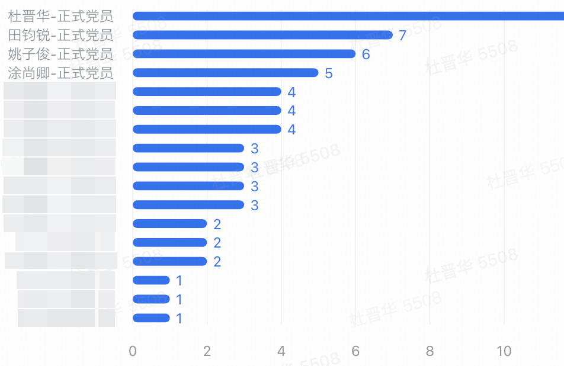

# 2026年一月：德育组织生活

> [计研五三党团班一体化发展台账](https://zhipu-ai.feishu.cn/docx/FvbhdIFY3otljqxCQ0ycmgxInbc?from=from_copylink)、[五三逐月活动组织统一说明](https://zhipu-ai.feishu.cn/sheets/OJ3Fsi2B1hIEA4t6t9yc2YA4n0b?from=from_copylink)
>
> 时间：17:00 - 我们5点拍下照，有事的同学可以提前离开
>
> 地点：自强科技楼-301A

# 一、理论学习

> 强化政治引领，明确学习要求。组织生活会前，党支部要组织党员深入学习贯彻党的 **二十届四中全会精神** ，跟进学习 **习近平总书记重要讲话精神** ，用党的创新理论武装头脑、指导实践、推动工作，切实把思想和行动统一到党中央决策部署和学校党委要求上来。
>
> 内容：群众视角进行观点分享
>
> 主讲：周卞思宁-25级-硕一-唐杰

1. 违规违纪案例警示教育
2. 研究生在校纪律教育
3. 党章对研究生的指导作用
4. 党史对研究生的参考作用
5. 学习《中国共产党思想政治工作条例》

文件：[Works/Social_Works/相关材料/1月活动.pptx](./相关材料/1月活动.pptx)

# 二、谈心谈话

开展谈心谈话，广泛征求意见。党支部委员之间必谈，委员和党员之间广泛谈，倡导党员之间相互谈。

谈心谈话要诚恳听取党员对支部工作和支委会成员的意见建议，注意了解党员学习科研及生活情况、思想状况和心理状态，有针对性地做好思想政治工作。

# 三、查摆问题

联系思想工作实际查摆问题。

（1）支委会要对照党章党规党纪等规定的职责任务，结合深入贯彻中央八项规定精神学习教育，重点查找在落实全面从严治党政治责任和作风建设、攻坚克难推动发展及主动发挥作用、服务班级同学成长成才等方面的突出问题，并深入分析原因。

* 组织生活参与不积极
* 组织生活内容没有充分调研群众需要

（2）党员要对照党员义务，全面查找在党员意识、理论学习、能力本领、作用发挥、工作作风等方面的不足和问题。

| 姓名   | 自我反思                                                                                                                                                                             | 支部意见                                                                                             |
| ------ | ------------------------------------------------------------------------------------------------------------------------------------------------------------------------------------ | ---------------------------------------------------------------------------------------------------- |
| 杜晋华 | 调动群众积极性方面需要加强                                                                                                                                                           | 活动对科研有促进作用                                                                                 |
| 冯卓楠 | 参加支部活动较少，未能充分体现老党员的先锋模范带头作用                                                                                                                               | 把党团活动和科研实践相结合，学会用党的先进理论指导我们的科研创新                                     |
| 张丹   | 理论学习时间不足，与群众联系减少                                                                                                                                                     | 建议定期组织批评与自我批评，相互学习的活动                                                           |
| 潘喜瑞 | 在理论学习上投入时间还不够，党员的带头模范作用没有充分展现                                                                                                                           |                                                                                                      |
| 田钧锐 | 对党员关注不足                                                                                                                                                                       | 加强组织管理                                                                                         |
| 涂尚卿 | 理论学习不足                                                                                                                                                                         |                                                                                                      |
| 刘金鑫 | 因为临近毕业，忙于各种事情，时常熬夜，对于支部活动的参与不足                                                                                                                         | 加强对党员的要求，例如活动出勤等                                                                     |
| 姚子俊 | 在过去的一段时间里，我的精力主要投入到毕业工作和与低年级同学的学术合作工作中，疏忽了个人身体的锻炼                                                                                   | 希望支部可以组织一些体育主体的组织生活                                                               |
| 齐韵嘉 | 本人本学期在党员意识强化、理论学习主动性上尚有不足，学习存在浮于表面情况，能力本领提升节奏偏缓，后续会稳步整改、主动提升。                                                           |                                                                                                      |
| 吕博文 | 作为党员，我在理论学习的系统性和深度上还有不足，将进一步强化党员意识，提升业务能力，改进工作作风，更好地发挥先锋模范作用。                                                           | 建议支部多开展一些实践类的主题党日活动，增强党员凝聚力；同时可以优化学习形式，提升理论学习的实效性。 |
| 黄植滇 | 近段时间，我积极参加了支部活动和学习，并在工作中充分锻炼了科研能力，保持严谨的工作态度。但是我也意识到近期对党的最新理论自主学习方面有所疏漏，需要在接下来的一段时间里自觉加强学习。 |                                                                                                      |

# 四、支部与党员评议

召开组织生活会，开展民主评议党员和党支部工作评议。

（1）党支部书记报告党支部2025年工作，通报2024年整改措施落实情况，及支委会查摆问题情况。

* 文件：[Works/Social_Works/相关材料/2025秋：计研五三带班助理-杜晋华.pptx](./相关材料/2025秋：计研五三带班助理-杜晋华.pptx)

（2）党员开展批评和自我批评，联系具体人、具体事，不讲空话套话，不搞一团和气。

（3）开展民主测评。采取发放测评表的方式（附件1），按照“优秀、合格、基本合格、不合格”四种等次，对党员进行测评。

（4）通过电子测评票方式，开展党支部工作评议。

需要注意：

（1）党员人数较多的党支部，批评和自我批评环节可以在党小组进行，民主测评要在全体党员范围进行。

（2）党支部可根据实际邀请一定数量积极分子和群众参加组织生活会和评议工作。

（3）组织生活会应面对面开展，少数不能现场出席的党员可以线上参加。

（4）2025年11月1日以后新成立党支部，可不开展对党支部工作的评议，但需开展民主评议党员。

经过所有党员投票：杜晋华、田峻锐、姚子俊和涂尚卿被评选为优秀党员。

# 五、组织评定

党支部根据测评情况和日常表现客观公正作出评价、确定等次并向党员本人反馈。评为“优秀”的比例一般不超过参加评议的正式党员的三分之一。对评定为“基本合格”的党员，由所在党委负责人和党支部书记共同对其进行约谈，帮助改进提高。对评定为“不合格”的党员，要立足教育转化，按规定作出组织处置。

需要注意：（1）目前在国（境）外短期工作、学习、生活的党员应参加评议。已在国（境）外时间较长的党员和组织关系滞留在校党员，可不参加评议。（2）预备党员参加评议，但不评定等次。（3）受党纪处分党员的等次确定，按照有关规定执行。

# 六、整改措施

根据查摆问题和党员群众意见建议，支委会、党员要制定整改措施，及时整改到位。党支部需在党组织党员管理系统中填报支委会查摆问题、整改措施和民主评议党员结果，并将党支部问题清单和整改措施向支部内党员公开、接受监督。

**支部查摆问题清单及下一年整改措施**

**一、支部查摆问题清单**

**（一）理论学习方面**

• 多名支部成员理论学习投入时间不足，存在学习浮于表面、缺乏系统性和深度的问题（张丹、潘喜瑞、涂尚卿、齐韵嘉、吕博文、黄植滇）。

• 部分成员对党的最新理论自主学习意识薄弱，存在疏漏，学习主动性有待提升（黄植滇、齐韵嘉）。

**（二）支部活动参与方面**

• 个别成员参加支部活动较少，参与积极性不足，尤其临近毕业的成员因事务繁忙出现出勤不规律问题（冯卓楠、刘金鑫）。

• 支部活动形式有待优化，缺乏实践类、体育类主题活动，未能充分结合成员需求和科研实际（姚子俊、吕博文）。

**（三）先锋模范作用发挥方面**

• 部分老党员未能充分体现先锋模范带头作用（冯卓楠）。

• 部分成员党员意识不够强烈，先锋模范作用未充分展现，业务能力与党员身份匹配度需提升（潘喜瑞、齐韵嘉、吕博文）。

**（四）群众联系与组织管理方面**

• 部分成员调动群众积极性的能力不足，与群众联系有所减少（杜晋华、张丹）。

• 支部组织管理不够细致，对党员的关注、要求不够严格，缺乏有效的监督提醒机制（田钧锐、刘金鑫）。

**（五）个人自身建设方面**

• 部分成员因学业、科研繁忙，忽视个人身体锻炼，作息不规律（姚子俊、刘金鑫）。

**二、下一年整改措施实施计划**

**（一）强化理论学习，提升思想认识**

1. 制定系统学习计划，每月固定组织1次集中理论学习，结合线上自主学习模式，明确学习内容（党的最新理论、方针政策）和学习时长，要求成员做好学习笔记，定期提交学习心得，支部定期检查督促。
2. 优化学习形式，采用专题研讨、线上答题、心得分享会等多种形式，避免学习浮于表面，提升理论学习的实效性和趣味性，针对学习薄弱的成员，安排党员结对帮扶。
3. 引导成员树立自主学习意识，鼓励利用碎片化时间加强党的最新理论学习，支部定期推送学习资料，每季度组织1次理论学习测试，检验学习成果。

**（二）优化支部活动，提升参与热情**

1. 结合成员需求和科研实际，丰富活动形式，每季度组织1次实践类主题党日活动（如科研先锋分享、基层服务等），每半年组织1次体育主题组织生活（如集体健身、趣味运动会等），增强活动吸引力。
2. 加强活动考勤管理，明确支部活动出勤要求，建立出勤登记制度，对出勤不足的成员（尤其是临近毕业成员），提前沟通提醒，合理协调活动时间，确有特殊情况需提前请假，事后及时补学活动内容。
3. 推动党团活动与科研实践深度结合，组织党员分享科研经验、探讨学术难题，引导成员用党的先进理论指导科研创新，实现思想提升与科研进步双向促进（落实冯卓楠支部意见）。

**（三）压实党员责任，发挥先锋作用**

1. 强化党员意识教育，每季度组织1次党员谈心谈话，引导成员明确党员责任，尤其要求老党员主动发挥先锋模范带头作用，带动身边成员共同进步。
2. 建立党员先锋岗，结合成员科研、学习特长，明确岗位责任，要求党员在科研攻关、学习提升、群众服务中主动担当，定期开展党员先锋模范作用评价，倒逼作用发挥。
3. 组织成员定期开展自我反思和交流，每半年开展1次专题自查，对照党员标准查找不足，明确改进方向，持续提升业务能力和思想觉悟。

**（四）健全管理机制，密切联系群众**

1. 加强支部组织管理，完善党员管理台账，细化对党员的关注举措，定期了解成员思想、学习、科研和生活状况，对存在的问题及时提醒、帮助解决（落实田钧锐整改方向）。
2. 定期组织批评与自我批评活动，每季度开展1次，引导成员相互监督、相互学习、共同进步，拉近党员之间、党员与群众之间的距离（落实张丹支部意见）。
3. 开展群众联系专项行动，要求每位党员每月至少与2名群众沟通交流，了解群众需求，主动提供帮助，提升调动群众积极性的能力，推动形成互帮互助的良好氛围。

**（五）关注个人建设，促进全面发展**

1. 引导成员树立健康生活理念，结合体育主题组织生活，鼓励成员合理安排时间，坚持身体锻炼，避免长期熬夜，养成规律作息。
2. 针对临近毕业成员，支部主动对接，了解其学业、就业压力，协调资源提供帮助，引导其合理平衡毕业事务与支部活动、个人健康，避免顾此失彼。

**三、整改保障**

• 明确责任分工，支部书记牵头负责整改工作，每位支委分工对接具体整改任务，确保各项措施落地见效。

• 建立整改台账，定期跟踪整改进度，每半年开展1次整改成效评估，根据评估结果调整优化整改措施，确保问题整改到位。

• 加强宣传引导，及时通报整改情况，鼓励成员主动参与整改，营造比学赶超、共同进步的良好氛围，推动支部建设整体提升。
